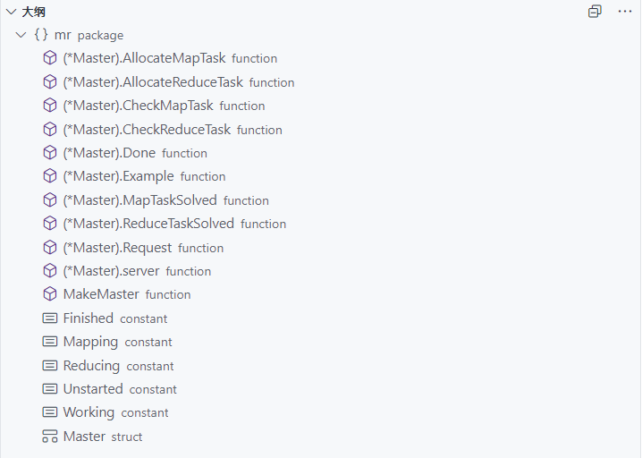
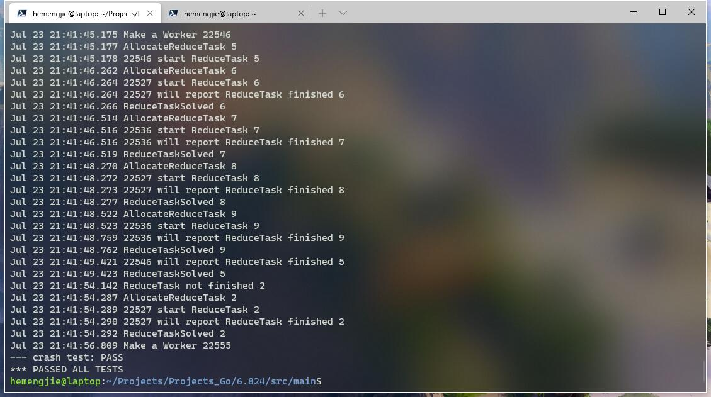

 **[6.824](https://pdos.csail.mit.edu/6.824/index.html) - Spring 2020**

# 6.824 Lab 1: MapReduce

## Introduction

In this lab you'll build a MapReduce system. You'll implement a worker process that calls application Map and Reduce functions and handles reading and writing files, and a master process that hands out tasks to workers and copes with failed workers. You'll be building something similar to the [MapReduce paper](http://research.google.com/archive/mapreduce-osdi04.pdf).

[原文]: https://pdos.csail.mit.edu/6.824/labs/lab-mr.html

## Design

**For more details or design ideas, you can  mail to njtech_hemengjie@qq.com.**

### RPC

```
worker:
	ask for a task

	complete a task
		args: Taskkind Tasknumber
master:
	map task
		args: Tasknumber Filename Nreduce

	reduce task
		args:  Tasknumber Nmap

	exit task

	wait task
```

### Master



## Results

